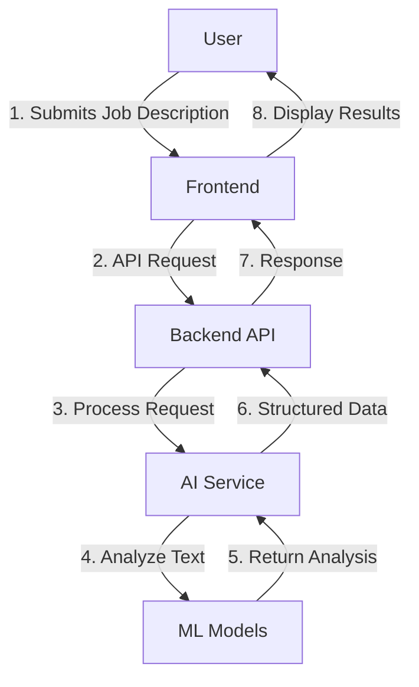

# System Architecture Overview

This document provides a high-level overview of the Resume Velvit Thunder system architecture, including its components, data flow, and design decisions.

## System Components

### 1. Frontend

**Technologies**:
- React.js with TypeScript
- Next.js for server-side rendering
- Tailwind CSS for styling
- Redux for state management

**Key Features**:
- Responsive design for all devices
- Real-time preview of resume changes
- Drag-and-drop interface for resume sections
- Template selection and customization

### 2. Backend API

**Technologies**:
- Python 3.9+
- FastAPI framework
- SQLAlchemy ORM
- Pydantic for data validation

**Key Features**:
- RESTful API design
- JWT-based authentication
- Rate limiting and request validation
- Comprehensive error handling

### 3. Database

**Primary Database**:
- PostgreSQL for production
- SQLite for development and testing

**Data Models**:
- Users and authentication
- Resumes and templates
- Job descriptions and analyses
- User preferences and settings

### 4. AI/ML Services

**Components**:
- NLP pipeline for job description analysis
- Resume scoring and matching algorithm
- Suggestion engine for resume improvements

**Integration**:
- Python-based ML models
- TensorFlow/PyTorch for deep learning
- Spacy for NLP tasks

## Data Flow

## Authentication Flow

1. User submits credentials
2. Backend verifies credentials against database
3. JWT token is generated and returned
4. Token is stored securely (HTTP-only cookie)
5. Token is included in subsequent requests
6. Backend validates token on each request

## Security Considerations

### Data Protection
- All data encrypted in transit (HTTPS/TLS 1.2+)
- Sensitive data encrypted at rest
- Regular security audits and dependency updates

### Authentication
- JWT with short expiration times
- Refresh token mechanism
- Secure cookie settings (HttpOnly, Secure, SameSite)

### Rate Limiting
- Global rate limiting
- Per-user rate limiting
- IP-based blocking for abuse prevention

## Scalability

### Horizontal Scaling
- Stateless API design
- Containerized services
- Load balancing support

### Caching
- Redis for session storage
- CDN for static assets
- Database query caching

## Monitoring and Logging

### Metrics
- Request/response times
- Error rates
- System resource usage

### Logging
- Structured logging (JSON format)
- Centralized log management
- Retention policies

## Deployment Architecture

### Development
- Local development with Docker Compose
- Hot-reloading for frontend and backend

### Staging/Production
- Container orchestration with Kubernetes
- CI/CD pipeline with GitHub Actions
- Blue/green deployments

## Integration Points

### Third-party Services
- Email service (SendGrid, etc.)
- Cloud storage (AWS S3, etc.)
- Analytics (Google Analytics, etc.)

### Webhooks
- Resume generation completion
- Analysis results
- System notifications

## Future Considerations

### Planned Features
- Multi-language support
- Advanced analytics dashboard
- Integration with job boards
- Mobile application

### Technical Debt
- Database optimization
- Test coverage improvements
- Documentation updates
